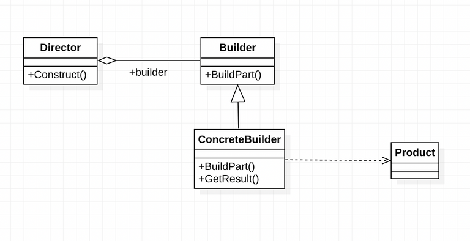

# Builder Pattern

1. 빌더 패턴이란?

복잡한 객체의 생성 과정과 표현을 분리하기위한 디자인 패턴.

2. UML



3. 코드

```kotlin
abstract class BarGraphBuilder {
	protected val barGraph = BarGraph()
	abstract fun buildXAxis()
	abstract fun buildYAxis()
}

class EnergeGraphBuilder : BarGraphBuilder() {
	override fun buildXAxis()  {
		graph.setXAxis(listOf<Float>(3.5f,4f))
	}

	override fun buildYAxis()  {
		graph.setYAxis(listOf<Float>(100.5f,200.5f))
	}
	...
}

class BillGraphBuilder : BarGraphBuilder() {
	override fun buildXAxis()  {
		graph.setXAxis(listOf<Float>(3.5f,4f))
	}

	override fun buildYAxis()  {
		graph.setYAxis(listOf<Float>(3500f,4000f))
	}
	...
}

class BarGraphDirector {
	private builder : GraphBuilder
	
	fun buildBarGraph() {
		builder.buildXAxis()
		builder.buildYAxis()
		...
	}
}
```

$참고- Effective Java에서의 Builder Pattern

이펙티브 자바에서 말하는 빌더패턴은 객체 생성을 깔끔하고 유연하게 하기 위한 방법으로, GoF의 빌더 패턴의 목적과 다르다.

1. 생성 인자가 많을 경우 각각의 인자가 의미하는 데이터를 알기 어려움. - 가독성 문제
2. 로직에 따라 생성인자가 달라질 수 있음. - 일반적 overloading으로 해결

아래와 같이 코틀린에서는 인자 기본값 설정이 가능하기 때문에 필요한 값만 입력받을 수 있고, 

BarGraph( var xAxis : AxisData? = null , ...)

아래와 같이 인자의 이름을 적어서  전달 할 수 있으므로 코틀린에서는 Effective java 에서 말하는 Builder pattern은 거의 적용하지 않는다.

val barGraph = BarGraph(

yAxis = yAxisData,

xAxis = xAxisData,

legend = legendData,

)

```java
class BarGraph() {
		private AxisData xAxis;
		private AxisData yAxis;
		private LegendData legend;
		private GraphData graphData;

		class Builder{
			private AxisData xAxis;
			private AxisData yAxis;
			private LegendData legend;
			private GraphData graphData;
			public Builder(AxisData xAxis, AxisData yAxis, LegendData legend, GraphData graphData) {
				this.xAxis = xAxis;
				this.yAxis = yAxis
				this.legend = legend;
				this.graphData = graphData;
			}

			public Builder setYAxis(AxisData yAxis) {
				this.yAxis = yAxis;
				return this;
			}

			public Builder setGraphData(GraphData graphData) {
				this.graphData = graphData;
				return this;
			}
			
			public Builder setXAxis(AxisData xAxis) {
				this.xAxis = xAxis;
				return this;
			}
			
			public BarGraph build() {
				BarGraph graph = new BarGraph(xAxis,yAxis,legend,graphData);
				return graph;
			}
		}
		
		
		
	}
}

public static void main(String[] args) {
		BarGraph.Builder bargraphBulder = new BarGraph.Builder();

		BarGraph barGraph = graphBuilder.setYAxis(yAxis)
																		.setXAxis(xAxis)
																		.setGraphData(graphData)
																		.build()
}

```