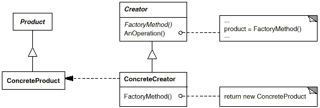

# Factory Method

1. 팩토리 메소드 패턴이란?

    객체를 생성하기 위한 인터페이스를 정의하고, 인스턴스 생성은 서브클래스가 결정하게  한다

    구현시 고려할 점-

    - 팩토리 메소드 페턴의 구현 방법은 크게 두 가지가 있다.
        - Creator를 추상 클래스로 정의하고, 팩토리 메소드는 abstract로 선언하는 방법.
        - Creator가 구체 클래스이고, 팩토리 메소드의 기본 구현을 제공하는 방법.
    - 팩토리 메소드의 인자를 통해 다양한 Product를 생성하게 한다.
        - 팩토리 메소드에 잘못된 인자가 들어올 경우의 런타임 에러 처리에 대해 고민할 것.
        - Enum 등을 사용하는 것도 고려할 필요가 있다.
    - 프로그래밍 언어별로 구현 방법에 차이가 있을 수 있다.

    Factory Method 패턴은 기반 클래스에 알려지지 않은 구체 클래스를 생성하는 Template Method라 할 수 있다. Factory Method의 반환 타입은 생성되어 반환되는 객체가 구현하고 있는 인터페이스이다. Factory Method는 또한 기반 클래스 코드에 구체 클래스의 이름을 감추는 방법이기도 하다(Factory Method는 부적절한 이름이다. 사람들은 객체를 생성하는 모든 메소드를 자연스레 팩토리 메소드라 부르는 경향이 있는데, 이러한 생성 메소드가 모두 Factory Method 패턴을 사용하는 것은 아니다).

2. UML

    

3. 코드

```java
abstract class Product {
    public abstract void use();
}
```

```java
class IDCard extends Product {
    private String owner;

    public IDCard(String owner) {
        System.out.println(owner + "의 카드를 만듭니다.");
        this.owner = owner;
    }

    @Override
    public void use() {
        System.out.println(owner + "의 카드를 사용합니다.");
    }

    public String getOwner() {
        return owner;
    }
}
```

```java
abstract class Factory {
    public final Product create(String owner) {
        Product p = createProduct(owner);
        registerProduct(p);
        return p;
    }
    protected abstract Product createProduct(String owner);
    protected abstract void registerProduct(Product p);
}
```

```java
class IDCardFactory extends Factory {
    private List<String> owners = new ArrayList<>();

    @Override
    protected Product createProduct(String owner) {
        return new IDCard(owner);
    }

    @Override
    protected void registerProduct(Product p) {
        owners.add(((IDCard) p).getOwner());
    }

    public List<String> getOwners() {
        return owners;
    }
}
```

```java
Factory factory = new IDCardFactory();
Product card1 = factory.create("홍길동");
Product card2 = factory.create("이순신");
Product card3 = factory.create("강감찬");
card1.use();
card2.use();
card3.use();
```