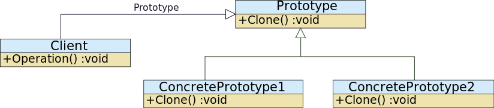

# ProtoType pattern

1. 프로토타입 패턴이란?

기본 원형이 되는 인스턴스를 사용해서 생성할 객체의 종류를 명시하고 데이터를 복사하여 새로운 객체를 생성하는 패턴.

주로 인스턴스를 생성하는 비용이 큰 객체를, 새로 생성하지 않고 기존의 것을 복사하여 사용하기 위해 사용.

2. UML



3. 코드

```java
abstract class Prototype implements Cloneable {
        @Override
        public Prototype clone() throws CloneNotSupportedException {
                return (Prototype)super.clone();
        }
  
        public abstract void setX(int x);
  
        public abstract void printX();
  
        public abstract int getX();
}
  
/**
 * Implementation of prototype class
 */
class PrototypeImpl extends Prototype {
        int x;
  
        public PrototypeImpl(int x) {
                this.x = x;
        }
  
        public void setX(int x) {
                this.x = x;
        }
  
        public void printX() {
                System.out.println("Value :" + x);
        }
  
        public int getX() {
                return x;
        }
}
  
/**
 * Client code
 */
public class PrototypeTest {
        public static void main(String args[]) throws CloneNotSupportedException {
                Prototype prototype = new PrototypeImpl(1000);
  
                for (int i = 1; i < 10; i++) {
                        Prototype tempotype =  prototype.clone();
  
                        // Usage of values in prototype to derive a new value.
                        tempotype.setX( tempotype.getX() * i);
                        tempotype.printX();
                }
        }
}

```