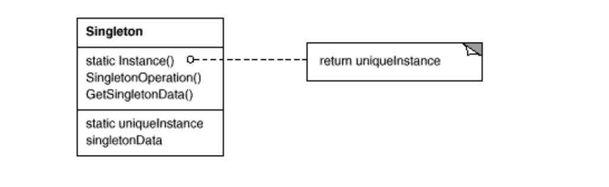

# Singleton Pattern

생성일: 2021년 5월 29일 오후 4:59

1. 싱글톤 패턴이란?

오직 하나의 클래스 인스턴스만 생성되도록 제한하여, 이에 대한 전역적인 접근점을 제공.

장점 : 한 번도 사용하지 않으면 인스턴스가 생성되지 않는다 = 런타임 최초 1회 생성

단점 :  게으른 초기화는 제어할 수가 없다. 

2. UML



3. Code 

밑은 자바의 example, (kotlin의 경우 object class로 쉽게 생성 가능하다.)

```java
public class JavaSingleton {
    private static JavaSingleton INSTANCE = null;
		
		private JavaSingleton() {}

    public synchronized static JavaSingleton getInstance() {
        if (INSTANCE == null)
            INSTANCE = new JavaSingleton();
        return INSTANCE;
    }
}
```